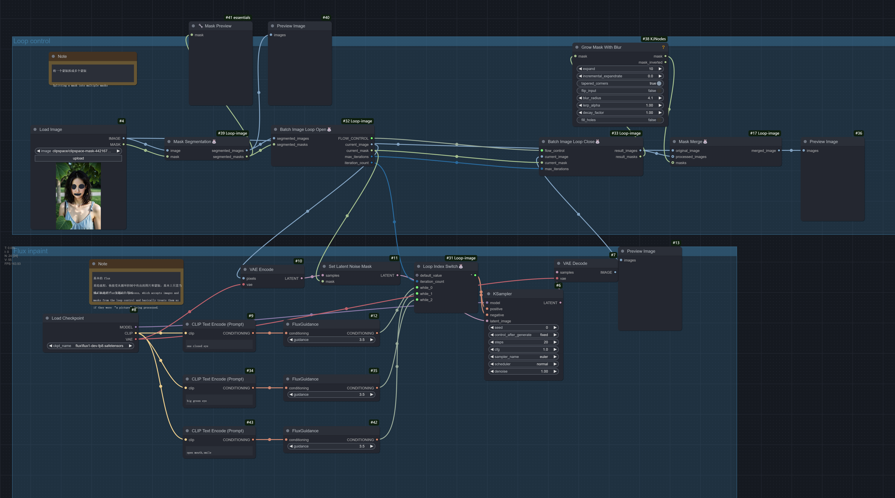
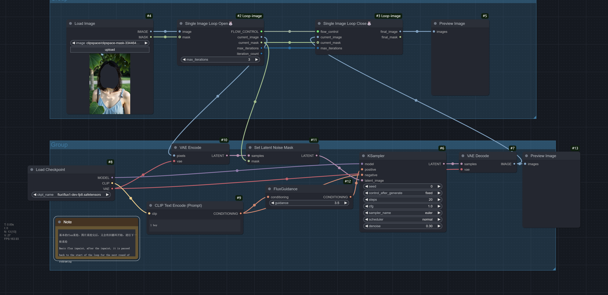

# ComfyUI Loop Image

[English](README.md) | [简体中文](README_CN.md)

---

## 最新更新 (2025-01-19)
新增路径选择示例工作流，展示了Loop Index Switch的高级用法。该示例位于"examples/Route_Selection"，通过懒加载特性实现基于迭代次数的路径选择：
- 第一次迭代(0)：执行Flux Redux工作流
- 第二次迭代(1)：执行Flux Pulid工作流

详细实现请查看示例文件。

---

## 简介
ComfyUI Loop Image是一个专门用于处理图像循环操作的节点包。它提供了两种主要的循环处理模式：批量图像处理(Batch)和单图像重复处理(Single)，以及配套的图像分割与合并功能。

## 批量处理与单图处理的区别

### 批量图像处理
- 适用于需要同时处理多个不同区域的场景
- 通过Mask Segmentation节点将图像分割成多个部分
- 每次循环处理一个分割区域
- 所有区域处理完成后通过Mask Merge合并结果

### 单图像处理
- 适用于需要对同一图像进行多次处理的场景
- 每次循环使用上一次的处理结果作为输入
- 可以实现渐进式的图像修改
- 适合迭代优化类的任务

## 节点说明

### 1. 批量处理节点详解

#### Mask Segmentation🐰 (遮罩分割)
- **功能说明**
  - 将一个包含多个独立区域的遮罩图自动分割成独立的遮罩序列
  - 每个分割后的遮罩对应原图中的一个独立区域
  - 分割基于连通区域分析，即相互不连接的区域会被分为不同部分

- **分割规则**
  - 相互独立的区域会被识别为不同的部分
  - 包含孔洞的区域会被正确处理，保持孔洞结构

- **顺序规则**
  - 分割后的遮罩按照从左到右排列，若左右位置相等，再按照从上到下的顺序
  - 排序依据是每个区域最左边的像素点的位置，再按照最上边的像素点的位置
  - 这个顺序决定了后续循环处理的顺序
  - 例如：如果遮罩中有三个区域，最左边的区域将是第0次迭代，中间的是第1次，最右边的是第2次

#### Batch Image Loop Open🐰 (批量循环开始)
- **输入输出详解**
  - 输入：
    - segmented_images: 来自Mask Segmentation的图像序列
    - segmented_masks: 来自Mask Segmentation的遮罩序列
  - 输出：
    - current_image: 当前迭代处理的图像部分
    - current_mask: 当前迭代的遮罩
    - max_iterations: 总迭代次数（等于分割区域的数量）
    - iteration_count: 当前迭代次数（从0开始）

- **使用说明**
  - current_image和current_mask可以直接用于后续处理
  - iteration_count可以连接到Loop Index Switch来选择不同的处理参数
  - max_iterations用于循环控制，一般不需要手动使用

#### Batch Image Loop Close🐰 (批量循环结束)
- **输入输出详解**
  - 输入：
    - flow_control: 来自Loop Open的控制信号
    - current_image: 处理后的当前图像
    - current_mask: 处理后的当前遮罩
    - max_iterations: 来自Loop Open的总迭代次数
  - 输出：
    - result_images: 所有处理完成的图像序列
    - result_masks: 所有处理完成的遮罩序列

#### Mask Merge🐰 (遮罩合并)
- **功能说明**
  - 将循环处理后的多个图像区域合并回原始图像
  - 使用遮罩确保每个处理过的区域正确放回原位
  - 保持未处理区域的原始内容不变

- **使用技巧**
  - original_image: 使用原始输入图像
  - processed_images: 连接Loop Close的result_images输出
  - masks: 连接Loop Close的result_masks输出

这样的批量处理系统允许你对图像的不同区域应用不同的处理方法，特别适合需要对图像不同部分进行差异化处理的场景。

### 2. 单图处理节点详解

#### Single Image Loop Open🐰 (单图循环开始)
- **功能说明**
  - 对同一张图像进行多次迭代处理
  - 每次迭代都使用上一次的处理结果作为输入
  - 适合需要渐进式改善或多次优化的场景

- **输入参数详解**
  - **必需输入**：
    - image: 需要处理的原始图像
    - max_iterations: 最大迭代次数（1-100）
  - **可选输入**：
    - mask: 可选的处理区域遮罩

- **输出参数详解**
  - current_image: 当前迭代的图像（第一次是原始图像，之后是上一次处理的结果）
  - current_mask: 当前使用的遮罩（如果提供了遮罩）
  - max_iterations: 设定的最大迭代次数
  - iteration_count: 当前迭代次数（从0开始）

#### Single Image Loop Close🐰 (单图循环结束)
- **输入参数详解**
  - **必需输入**：
    - flow_control: 来自Loop Open的控制信号
    - current_image: 当前迭代处理后的图像
    - max_iterations: 来自Loop Open的最大迭代次数
  - **可选输入**：
    - current_mask: 处理后的遮罩（如果使用了遮罩）

- **输出参数详解**
  - final_image: 所有迭代完成后的最终图像
  - final_mask: 最终的遮罩（如果使用了遮罩）

#### 单图处理的特点和应用场景
1. **渐进式处理**
   - 每次迭代都基于上一次的结果
   - 可以实现累积效果
   - 适合需要多次微调的场景

2. **使用场景示例**
   - 图像渐进式增强
   - 迭代式风格转换
   - 多次降噪处理
   - 逐步细节优化
  

### 与Loop Index Switch的配合使用
- 可以使用Loop Index Switch根据iteration_count选择不同的处理参数

这种单图循环处理方式特别适合需要精细调整或渐进式改善的场景，通过多次迭代可以达到更理想的处理效果。配合Loop Index Switch，还可以实现更复杂的参数控制策略。

### 3. 特殊功能节点
- **Loop Index Switch🐰**
  - 功能：根据当前循环次数选择不同的输入
  - 使用方法：
    1. 右键点击节点选择"Add Loop Input"
    2. 输入想要添加的循环序号(0-99)
    3. 连接对应的输入
    4. 可以通过"Remove Loop Input"删除不需要的输入
  - 注意：只有当前迭代次数对应的输入会被计算，其他输入会被跳过，提高效率

## 使用建议
1. 批量处理适合需要在图像不同区域应用不同处理的场景
2. 单图处理适合需要多次迭代优化的场景
3. 合理使用Loop Index Switch节点可以实现在不同迭代次数使用不同参数
4. 注意控制循环次数，避免过度处理

## 示例工作流

**批量图片工作流**

**单图片工作流**

## 致谢

本项目在开发过程中参考和借鉴了以下优秀的开源项目：

- [ComfyUI-Easy-Use](https://github.com/yolain/ComfyUI-Easy-Use/) - 提供了优秀的节点设计思路和实现参考
- [execution-inversion-demo-comfyui](https://github.com/BadCafeCode/execution-inversion-demo-comfyui) - 提供了循环控制的核心实现思路
- [cozy_ex_dynamic](https://github.com/cozy-comfyui/cozy_ex_dynamic) - 提供了动态输入节点的实现参考

特别感谢这些项目的作者们为ComfyUI社区做出的贡献！

## 关于作者

欢迎访问作者的B站主页，获取更多ComfyUI教程和更新：
- B站：[CyberEve](https://space.bilibili.com/16993154)
- 内容包括：
  - ComfyUI节点开发教程
  - 工作流使用教程
  - 最新功能更新介绍
  - AI绘画技巧分享

如果您觉得这个项目对您有帮助，欢迎关注作者B站账号获取更多资源！

---

*Note: 本项目遵循开源协议，欢迎提出建议和改进意见。*